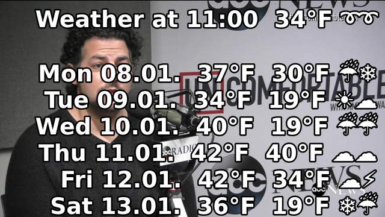
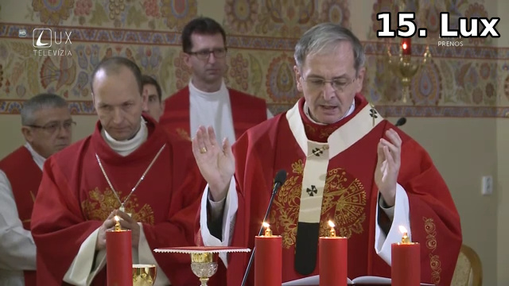

### mpv scripts

This repository contains Lua scripts for [mpv player](https://github.com/mpv-player/mpv "GitHub project") 
These scripts are completely independent and can be used as such. Just copy whichever scripts you're interested 
in to your `scripts/` directory (see [here](https://mpv.io/manual/master/#lua-scripting) for installation instructions).

* [Channel by Name](#channel-by-name)
* [OSD Clock](#osd-clock)
* [OSD Ext Info](#osd-ext-info)
* [Show Stream Title](#show-stream-title)
* [TV](#tv)
* [Channel Survey Simple](#channel-survey-simple)

Other user mpv scripts can be found in [mpv-wiki-user-scripts](https://github.com/mpv-player/mpv/wiki/User-Scripts "mpv scripts") repository.

### [Channel by Name](channel-by-name.lua)

For iPTV mode the playlist is used as an iPTV channel list. Each playlist entry corresponds to one iptv stream and so to one iPTV channel. 
Switching channels is then just moving through playlist up or down.

Files:
* [channel-by-name.lua](channel-by-name.lua) - Lua script
* [channel-by-name.conf](channel-by-name.conf) - default config as template for user config

Example `Assign iPTV channel "CBC News" to the RC (remote controller) button "0"`

* copy channel-by-name.lua to your `scripts/` directory
* add following line to the `input.conf` file:

    ```
    0 script-message-to channel_by_name channel "CBC News"
    ```

* make sure there is a "CBC News" entry in the `playlist` file, something like:

    ```
    #EXTINF:0,CBC News,,0
    https://nn.geo.cbc.ca/hls/cbc-1080.m3u8
    ```
    
* from now on the "0" keypress on the RC the channel "CBC News" will start playing no matter where in the playlist it is located 
(which index/position does it have)

* now you can label the key "0" on the RC as "CBC News" and on update or modify of the playlist the key "0" will stay assigned 
to the channel "CBC News"

### [OSD Clock](osd-clock.lua)


Periodically shows OSD clock with many configurable options:
* interval ... how often to show OSD clock, either seconds or human friendly format like '1h 33m 5s' is supported (default 
is '15m' e.g. the clock will be shown 4 times per hour at minutes equal to 00,15,30,45)
* format   ... date format string (default "%H:%M")
* duration ... how long [in seconds] OSD stays on screen, fractional values supported (default 1.2)
* key      ... to bind showing OSD clock on request (false for no binding; default 'h' key)
* name     ... symbolic name (can be used in input.conf, see mpv doc for details; default 'show-clock')

There is an implemented logic to start nicely at interval boundary, for example:
    
    interval='10m' will dipslay OSD clock at 10,20,30,40,50,00
    interval='15m' will dipslay OSD clock at 15,30,45,00
    
Note: OSD Clock (and more) is also available as optional modality in [OSD Ext Info](#osd-ext-info)
     
Files:
* [osd-clock.lua](osd-clock.lua) - Lua script
* [osd-clock.conf](osd-clock.conf) - default config as template for user config

### [OSD Ext Info](osd-ext-info.lua)

Periodically shows OSD various external (e.g. not related to mpv player nor media played) info (modality) like weather 
forecast, new emails, traffic conditions, currency exchange rates, clock, server status, etc.

Modalities currently (jan'18) implemented (stay tuned as more modalities will be added later):

* OSD CLOCK - periodicaly shows the clock - configurable options:
  * interval ... how often to show OSD clock, either seconds or human friendly format like '1h 33m 5s' supported
  * format   ... date format string
  * duration ... how long [in seconds] OSD msg stays, fractional values supported
  * key      ... to bind showing OSD clock on request (false for no binding)

Note: Do not use simple [OSD Clock](#osd-clock) at the same time as this modality


* OSD EMAIL - periodicaly shows new email count - configurable options:
  * url      ... url to connect to imap/pop server
  * userpass ... authentication in login:password format
  * request  ... request to send to get new email count
  * response ... response from email server to parse to get raw new email count
  * cntofs   ... offset compensation of unread email count (will be subtracted before evaluatimg, should be 0)
  * showat   ... at what time to show OSD email status, seconds or human friendly format like '33m 5s' supported
  * interval ... how often to show OSD email status, either seconds or human friendly format like '1h 33m 5s' supported
  * osdpos   ... msg shown if count os new emails is positive (you have xx new emails)
  * osdneg   ... msg shown if count of new emails is negative (warning: fix offset cfg.cntofs)
  * osdzero  ... msg shown if count of new emails is equal zero (no new emails)
  * osderr   ... error message shown in case of any curl error
  * duration ... how long [in seconds] OSD msg stays, fractional values supported
  * key      ... to bind showing OSD email count on request (false for no binding)


* OSD WEATHER - periodicaly shows weather forecast and current condition
  The forecast data are shown in line per day format (lformat) with current condition as header (hformat).
  The icons/pictograms are composed of commonly available unicode symbols - configurable options:
  * url      ... url to retrieve forecast data (free yahoo API)
  * location ... textual location description like city, state (use only if you cannot get locid)
  * locid    ... location id (yahoo woeid), preferred over location even if location is provided (unique, faster query)
  * unit     ... units C for celsius, F for farenheit
  * showat   ... at what time to show OSD forecast, seconds or human friendly format like '33m 5s' supported
  * interval ... how often to show OSD forecast, either seconds or human friendly format like '1h 33m 5s' supported
  * hformat  ... OSD header format with current weather conditions
  * lformat  ... OSD weather forecats line (one per day)
  * days     ... how many days to show in forecast (yahoo gives max. 10)
  * duration ... how long [in seconds] OSD msg stays, fractional values supported
  * key      ... to bind showing OSD forecast on request (false for no binding)



Files:
* [osd-ext-info.lua](osd-ext-info.lua) - Lua script
* [osd-clock.conf](osd-clock.conf) - default config as template for user config
* [osd-email.conf](osd-email.conf) - default config as template for user config
* [osd-weather.conf](osd-weather.conf) - default config as template for user config

### [Show Stream Title](show-stream-title.lua)



Shows OSD stream title defined in the playlist on stream change. However, the `media-title` property
gets updated more frequently then the stream changes. Therefore it is important to filter out unwanted updates
which is implemented by configurable validation pattern `valid` (default pattern based on SMPlayer playlist format)

Configurable options:    
* format ... OSD text format (default "%N. %t")
* valid  ... validate the title from playlist, ignore invalid title changes (empty for valid all, default "%w+,,0$")

Files:
* [show-stream-title.lua](osd-clock.lua) - Lua script
* [show-stream-title.conf](osd-clock.conf) - default config as template for user config

### [TV](tv.lua)

Activate TV out on iPTV mpv player startup and deactivate TV out on iPTV mpv player shutdown. 
The script executes fully configurable shell sequences (e.g. xrandr on linux). On/Off scripts
are conditionaly executed based on the result of "test" script. This way the TV out is not activated
in the case of disconnected TV etc. The scripts can also be also used to activate ambient lighting while watching TV etc ...

Configurable options:
* test ... check if TV is connected (test if result is non empty, exitcode 0; default "xrandr | grep 'VGA1 connected'")
* on   ... executed once on mpv player startup  (TV ON;  default 'xrandr --output LVDS1 --off && xrandr --output VGA1 --mode 720x400 --output TV1 --auto')
* off  ... executed once on mpv player shutdown (TV OFF; default 'xrandr --output LVDS1 --auto')

**Note:**
xrandr seems to have problem turning off and on devices on single execution. Therefore it is wise to 
split execution to multiple commands sequenced with `and` like `cmd1 && cmd2` ...
There are also implicit security issues due to a nature of direct execution of commands !

Files:
* [tv.lua](tv.lua) - Lua script
* [tv.conf](tv.conf) - default config as template for user config

### [Channel Survey Simple](channel-survey-simple.lua)

Channel survey mode is periodic roundabout style channel switching.
There is an option key to toggle survey start and survey stop mode. 
If no trigger key is defined the survey mode starts upon loading the script. 
Each channel is shown configurable duration. Usefull when you want to scan channels 
or for security purposes like CCTV etc ...

Configurable options:
* duration  ... how long (in seconds) to show each channel, fractional values supported
* osd_start ... optional OSD message shown on survey mode start (%t token expands to duration)
* osd_stop  ... optional message shown on survey mode stop
* key       ... optional key to toggle survey mode (empy/nil for instant survey mode upnon load)

Files:
* [channel-survey-simple.lua](channel-survey-simple.lua) - Lua script
* [Channel-survey-simple.conf](channel-survey=simple.conf) - default config as template for user config


**keywords**: mpv, lua, script

